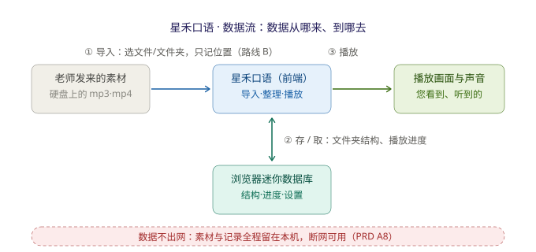

# 星禾口语 · 技术设计（TECH_DESIGN）

> 版本：v1.0（Day 5）｜ 上游文档：PRD.md（Day 4）、research.md（Day 3）｜ 范围：Day 7 MVP「一心复读机 promax」

## 1. 技术路线

**选定：路线 B —— 纯前端 + 文件系统访问（引用本地原文件）**

一句话：应用只由前端（网页）构成，素材**不复制、不上传**，浏览器记住文件在硬盘上的位置，播放时直接读取原文件。

### 为什么选它（对着 PRD 的理由）

1. **视频支持是 Day 4 确认的需求**。路线 B 是三条候选里唯一「视频多大都能直接播」的方案——零复制、零导入等待、不占双份硬盘空间。
2. **「数据不出网、断网可用」（PRD A8）是产品的灵魂卖点**（源自 Day 3 调研的差异化洞察），B 天然满足；任何引入后端或云存储的方案都会破坏它。
3. **MVP 只请「前端」一个角色**（分工见第 2 节），Day 7 的工作量可控；文件夹结构和播放进度这类小数据，浏览器自带的本地存储完全够用。

三条候选路线：A. 纯前端+复制进浏览器存储；B. 纯前端+引用原文件（选定）；C. 前端+后端/云存储（违反 A8，排除）。

### 已知代价与风险备案

| 代价 / 风险 | 说明 | 应对 |
|---|---|---|
| 依赖较新的浏览器能力（File System Access API） | 需要 Chrome / Edge；Firefox / Safari 不支持 | MVP 验收以 Edge（Windows 自带）为准 |
| 重新打开页面需授权一次 | 每次会话要点一次「允许访问」 | 一次点击换零复制零等待，可接受 |
| 该能力若在实现中受阻 | 属于较新技术，存在卡壳可能 | **降级备案：退回路线 A**（音视频复制进浏览器存储 IndexedDB），功能不变，仅导入变慢 |

## 2. 前后端与数据库分工

| 角色 | 本项目的安排 | 说明 |
|---|---|---|
| 前端 | **星禾口语页面（唯一角色）** | 素材导入、应用内文件夹管理、播放/变速/AB 复读、位置记忆，全部由前端完成 |
| 后端 | **无** | MVP 不设后端。没有服务器，所以没有广告位（F7 天然成立），数据也无处可去 |
| 数据库 | **浏览器本地存储（IndexedDB）充当「迷你数据库」** | 只存小数据：应用内文件夹结构、播放进度记录。素材本体不进数据库 |

**这个分工的直接后果**：
- A8「页面加载后断网，全功能可用」成立——因为一切都在本机；
- 远期扩展功能（班级管理、实时字幕统计、汇报老师）全部需要后端（多人的数据要汇到一处）——这正是它们被划入「本期不做」的技术根源。

## 3. 数据流

**一句话说清数据从哪来、到哪去**：数据从「老师发来的本地音视频文件」来，经浏览器导入后只在您的电脑里流转（组织、播放、记进度），最后以画面和声音回到您的眼睛和耳朵——**全程不出网**。

## 4. 关键技术点（Day 7 实现要点）

- **File System Access API**：选择文件夹/文件并拿到「引用」（路线 B 的核心）；
- **IndexedDB**：浏览器自带迷你数据库，存文件夹树与播放进度；
- **HTML5 audio / video**：浏览器自带的播放能力，变速用 `playbackRate`，AB 循环靠记录时间点；
- **纯静态页面**：无需服务器计算能力，部署简单。
